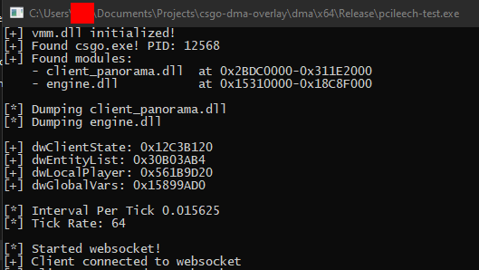
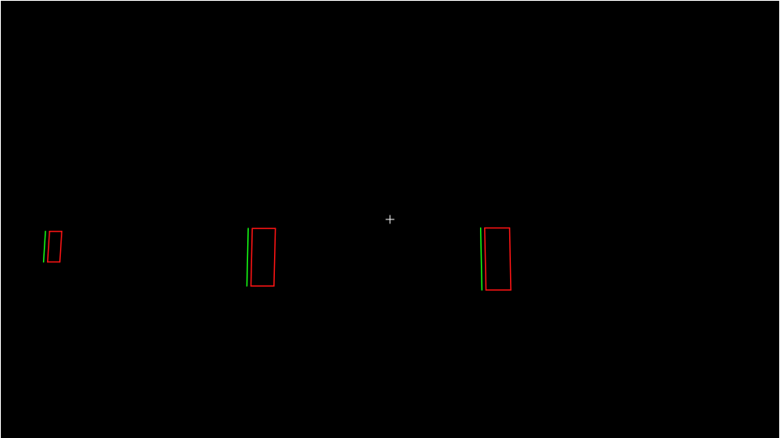
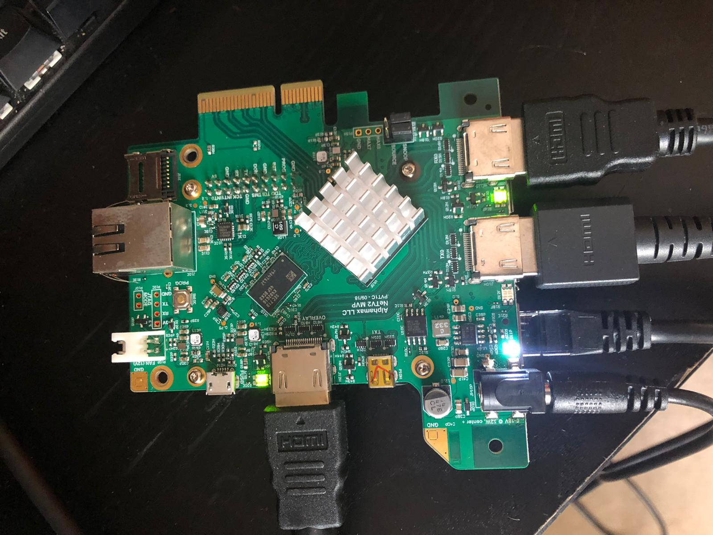

# CSGO DMA Overlay

This project creates a basic CS:GO ESP using Direct Memory Access. It reads player positions and view angles from memory computes a view matrix1 and then draws this on screen. This is tested to work with ESEA as of this release `27/04/2020`.

It uses pattern scanning to find the offsets to use so should work between game updates. Uses the [MemProcFS](https://github.com/ufrisk/MemProcFS) API to interface with windows. This was tested with a SP605 and NETV2, but would probably work with any compatible pcieleech compatible FPGA and generic HDMI overlay device.

1 The pointer to the original is not in the process page tables and I chose not to use offsets

## Videos

### Bots demo

### ESEA demo

## Components

There are three components to this project: The DMA Client and the Overlay client.

### DMA Client

This reads the csgo process using [pcieleech](https://github.com/ufrisk/pcileech) then creates a websocket for the overlay client to connect to on poort 9002.

### Overlay Client

This is a webpage that connects to the DMA client via a websocket and then draws the output to screen using p5.js

### HDMI Combining

I use a NETV2 which overlays the two HDMI streams to create the output which can then be plugged into any monitor this supports 1080p @ 60Hz

## Security

VAC:

Lol no chance VAC is too advanced.

ESEA:

There are some reports of pcileech being detected. I highly doubt this as scanning of the pci bus is highly intensive and would impact performance of a CPU bound game such as CS:GO, anyway use at your own risk. Just change your vendor ids I spoofed a realtek ethernet card and it works fine.

FACEIT:

Untested

## Known issues:

### Overlay and stream don't line up

The HDMI overlay and stream do not allign have fun fixing this, probably best done in software. [More Info](https://github.com/AlphamaxMedia/netv2-fpga/issues/20#issuecomment-618457906)

### ESEA Instability

ESEA place some weird patterns in memory specifically to trip up pattern scanners. If you can't find valid patterns try skipping/not skipping specific patterns.

### Overlay Latency

Could very likely be sped up. Ideas:

- Use `MemReadScatter` (Most likely to help)
- Stop using a web based overlay lmao

### General Instability

Doesn't work well between games never bothered to look at this

### Resolution awareness

Didnt bother to look at supporting multiple resolutions only supports 1920x1080 (16:9)

## Creditz

- Me :)
- [Ulf Frisk](https://github.com/ufrisk) for pcieleech and MemProcFS. One word: AMAZING
- [Bunnie](https://github.com/bunnie) for creating the NETV2.
- [Flaw](https://github.com/FLAWWW) for listening to me ramble
- [bi0phaz3](https://github.com/raka-gunarto) good memes
